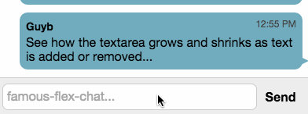

famous-flex
==========

Auto-sizing TextareaSurface for famo.us.



TextareSurface for famo.us that emits an event everytime the 'ideal' height for fitting the
content changes. This event can then be used to set the size of the Surface to fit the content.

## Demos

- [Chat demo](https://rawgit.com/IjzerenHein/famous-flex-chat/master/dist/index.html) ([source](https://github.com/IjzerenHein/famous-flex-chat))


## Getting started

Install using bower or npm:

	bower install famous-autosizetextarea

	npm install famous-autosizetextarea


## Auto-sizing a text-area

`AutosizeTextareaSurface` emits an event whenever the ideal height changes. Use this
event to set the size, or set the size of the parent container.

```javascript
var AutosizeTextareaSurface = require('famous-autosizetextarea/AutosizeTextareaSurface');

// create text-area
var textArea = new AutosizeTextareaSurface({
	origin: [0, 1],
	align: [0, 1],
	classes: ['mytextarea'],
	size: [undefined, 30] // initial size
});
this.add(textArea);

// automatically resize text-area when typed text changes
textArea.on('scrollHeightChanged', function(scrollHeight) {
	textArea.setSize([undefined, scrollHeight]);
});

// use `getScrollHeight` to obtain the ideal height
var scrollHeight = textArea.getScrollHeight();
console.log('current ideal height is: ' + scrollHeight);
```


## Contribute

If you like this project and want to support it, show some love
and give it a star.


## Contact
- 	@IjzerenHein
- 	http://www.gloey.nl
- 	hrutjes@gmail.com

© 2014 - Hein Rutjes
